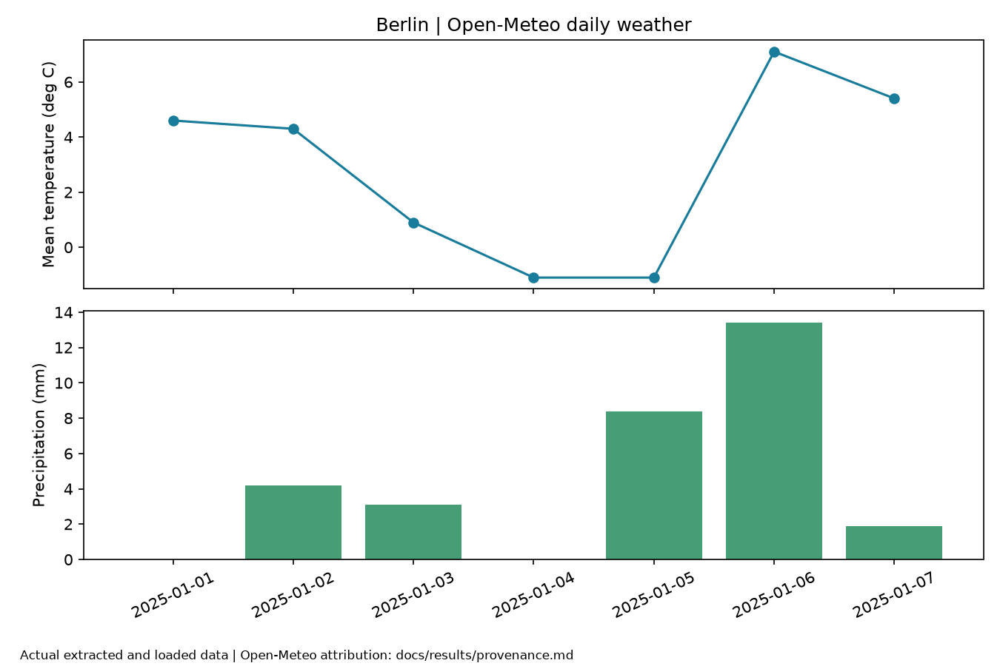
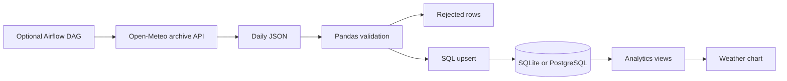

# Smart Data Engineering Pipeline

Extract European weather data, validate daily observations, and load repeatable SQL analytics with Python.



   
[](https://github.com/faizansahi/smart-data-engineering-pipeline/actions/workflows/ci.yml)

## Overview

An ETL pipeline built around Open-Meteo historical weather data. The CLI runs independently; an optional Airflow deployment schedules it.

## Business Problem

Logistics and operations analysis needs consistent weather context, but raw API responses contain missing values and must be safe to reload.

## Solution

Separate HTTP extraction, Pandas validation, SQL upserts, and run metadata. Publish SQL views for daily trends, location summaries, and anomaly rates.

## Key Features

- Fetch historical observations for Berlin, Hamburg, or Munich with bounded retries.
- Reject missing, non-numeric, infinite, negative wind/precipitation, and invalid-date values.
- Reject observations outside the requested interval.
- Upsert by location/date and record success or failure metadata.
- Provide an Airflow DAG and SQL analytics views.

## Architecture



[Architecture details](docs/architecture.md) · [Engineering decisions](docs/decisions.md)

## Technology Stack

Python 3.12, Pandas, Requests, Tenacity, SQLAlchemy, PostgreSQL/SQLite, Apache Airflow 2.10.5 (optional), Matplotlib, Docker Compose, Pytest, Ruff, and GitHub Actions.

## Demo / Results

The live Open-Meteo demo loaded **7 Berlin observations for 1–7 January 2025**, rejected 0 rows, and kept 7 rows after a second execution. The SQL summary returned 31.0 mm total precipitation. The chart is drawn from those loaded rows. The saved local execution used SQLite; PostgreSQL/container verification is recorded separately.

[Actual output](docs/results/demo.json) · [Test report](docs/results/tests.txt) · [Provenance](docs/results/provenance.md) · [Verification status](docs/results/verification.md)

Reproduce using a fresh local database:

```bash
python scripts/demo_pipeline.py
```

## Installation

Requires Python 3.12+. From this repository:

```bash
python -m venv .venv
# Linux/macOS: source .venv/bin/activate
# Windows PowerShell: .venv\Scripts\Activate.ps1
python -m pip install -e ".[dev,demo]"
python -m weather_pipeline.cli --location Berlin --start 2025-01-01 --end 2025-01-07
```

The CLI defaults to SQLite. The demo also applies the SQL analytics views. See [setup](docs/setup.md).

## Docker Setup

Copy `.env.example` to `.env`, set a unique URL-safe `POSTGRES_PASSWORD`, then run:

```bash
docker compose up --build --abort-on-container-exit --exit-code-from pipeline
```

Compose supplies PostgreSQL and persistent storage. The pipeline runs once. Airflow is optional; see setup. Docker was unavailable on the local Windows review machine; [verification status](docs/results/verification.md) records separate container checks.

## Environment Variables

| Variable | Default / requirement | Purpose |
|---|---|---|
| `DATABASE_URL` | `sqlite:///./weather.db` | SQLAlchemy connection URL |
| `LOCATION` | `Berlin` | Berlin, Hamburg, or Munich |
| `POSTGRES_PASSWORD` | Required for Compose | Local database password |

The app reads `.env`. Compose overrides the database URL with its internal PostgreSQL address. Keep real values out of Git.

## API Usage

This project exposes a CLI and SQL tables rather than an HTTP service.

```bash
python -m weather_pipeline.cli --location Hamburg --start 2025-01-01 --end 2025-01-07
```

[API / data contracts](docs/api.md).

## Tests

```bash
ruff format --check .
ruff check .
pytest --cov=weather_pipeline --cov-report=term-missing
python -m pip check
```

The recorded Windows run passed **11 tests** with **70% statement coverage**. Coverage describes this suite, not complete correctness.  GitHub Actions runs quality and container checks; its badge reports the current status.

## Project Structure

```text
src/weather_pipeline/     Application and domain logic
tests/                  Unit and integration tests
scripts/                Reproducible demos and clients
docs/                   Architecture, setup, API, decisions
docs/images/            Real screenshots and output visuals
docs/results/           Execution and test evidence
.github/workflows/      Automated checks
```

## Engineering Decisions

Natural-key upserts make reruns idempotent. A deterministic run ID identifies a location/date interval; its metadata describes the latest attempt. SQLite supports quick local tests, while Compose uses PostgreSQL. Anomaly flags use the current validated batch's mean and standard deviation.

## Limitations

The local evidence uses SQLite. Open-Meteo data is reanalysis, not a station measurement guarantee. Run metadata is overwritten on rerun rather than retained as an attempt history. Anomaly flags depend on batch boundaries. The CLI does not archive raw data automatically; the demo does. Airflow is optional and its standalone UI is a development setup.

## Future Improvements

Add per-attempt lineage, persistent raw storage, incremental watermarks, batch-independent anomaly baselines, and broader data-contract tests.

## Skills Demonstrated

Python, Data Engineering, ETL, Data Validation, Pandas, SQL, PostgreSQL, retry handling, idempotency, Airflow scheduling, Docker, Git, Pytest, and CI/CD checks.

## Relevance for German Werkstudent Roles

Relevant to Werkstudent Data Engineering roles: it connects a public API to validated relational data, SQL reporting, scheduling, and repeatable execution.
