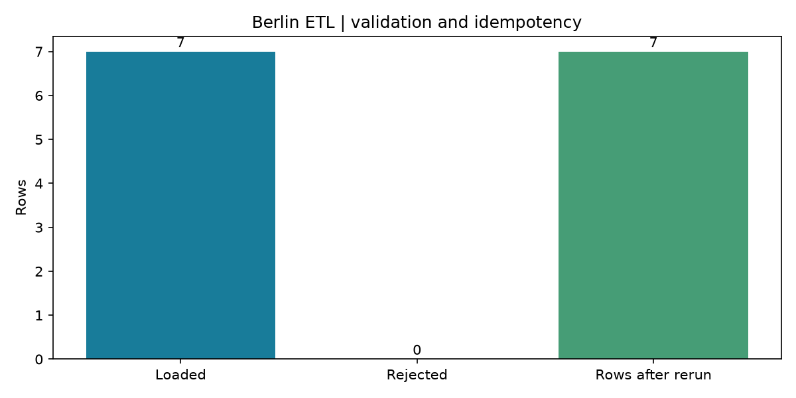

# Smart Data Engineering Pipeline

A Python ETL pipeline that turns Open-Meteo daily weather responses into validated SQL tables and analytics views.

## One week through the pipeline

The demo fetches Berlin weather for 1–7 January 2025, validates it, loads SQLite,
queries the analytics views, and loads the same interval again to check idempotency.
The saved run contains seven observations and no rejected rows. The chart uses
the loaded rows, not a separately prepared dataset.

[Raw API response](docs/results/source.json) · [SQL rows and run results](docs/results/demo.json)

Weather data: [Open-Meteo](https://open-meteo.com/), CC BY 4.0.
The archive contains reanalysis data; these are not guaranteed station measurements.

## Data flow

~~~mermaid
flowchart LR
  Source[Open-Meteo JSON] --> Validate[Pandas validation]
  Validate --> Rejected[Rejected row count]
  Validate --> Load[SQL upsert]
  Load --> DB[(analytics_weather)]
  DB --> Views[SQL views]
  Views --> Chart[Temperature / precipitation]
~~~

The input is raw JSON, validation uses an in-memory Pandas staging frame, and
the durable layer is a relational table plus SQL views. There are no separately
persisted raw or staging database layers. The demo archives its raw response;
the CLI currently does not.

- Required arrays must align. Invalid dates, nonnumeric or infinite measurements,
  negative wind/precipitation, and out-of-interval rows are rejected.
- A location/date key makes reloading an interval update rows without duplicating them.
- Extraction has a 30-second request timeout and at most three attempts.
- Run metadata records status, counts, and timestamps. Reruns replace the previous
  metadata for that interval rather than appending an attempt history.
- The anomaly flag uses two standard deviations within the current batch, so changing
  the batch boundaries can change the flag.

## Run an interval

Requires Python 3.12+. Create and activate a virtual environment, then:

~~~bash
python -m pip install -e ".[dev,demo]"
python -m weather_pipeline.cli --location Berlin --start 2025-01-01 --end 2025-01-07
~~~

Berlin, Hamburg, and Munich are supported. The CLI reads `DATABASE_URL` from the
environment or `.env`; it defaults to `sqlite:///./weather.db`.

~~~bash
python scripts/demo_pipeline.py
~~~

The demo requires network access and uses `weather-demo.db` unless `DATABASE_URL`
is set. Use a fresh database to reproduce the saved row-count checks.
It also applies `sql/analytics.sql`, which defines daily trends, per-location
summaries, and anomaly rates. This is a CLI/data project; it has no HTTP API.

## PostgreSQL and scheduling

Copy `.env.example` to `.env`, set a unique URL-safe `POSTGRES_PASSWORD`, then:

~~~bash
docker compose up --build --abort-on-container-exit --exit-code-from pipeline
~~~

The default stack executes one pipeline run. An optional Airflow 2.10.5 DAG is
provided in `dags/`; [setup](docs/setup.md) covers its Compose override.
Airflow uses an external Python environment because its SQLAlchemy requirements
conflict with the pipeline's SQLAlchemy 2 dependency. Image build and DAG import
are checked in CI; scheduled execution and the Airflow UI have not been verified.

## Checks

~~~bash
ruff check .
ruff format --check .
pytest --cov=weather_pipeline --cov-report=term-missing
python -m pip check
~~~

Tests cover validation failures, interval filtering, idempotent loading, and run metadata.
CI builds the pipeline image, loads a labeled fixture into PostgreSQL twice, and queries
the SQL views. [Verification notes](docs/results/verification.md) distinguish that fixture
from the live Open-Meteo demo.

The implementation uses Pandas, Requests, Tenacity, SQLAlchemy, PostgreSQL/SQLite,
and Matplotlib. The main remaining data engineering work is persistent raw storage,
per-attempt lineage, and an anomaly baseline independent of extraction windows.

[Data contracts](docs/api.md) · [Design decisions](docs/decisions.md) ·
[Test output](docs/results/tests.txt) · [Data provenance](docs/results/provenance.md)
