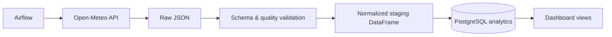

# Smart European Weather Data Pipeline

An idempotent ETL pipeline that extracts credential-free Open-Meteo historical weather data, validates and normalizes daily observations, loads PostgreSQL analytics tables, records execution metadata, and schedules execution through Airflow.



## Business value and features

Operations and sustainability teams need reproducible weather context for demand, logistics, and anomaly analysis. This pipeline supplies daily trends, location comparisons, precipitation/wind averages, and anomaly rates. Retries, deterministic run IDs, upserts, rejected-row counts, and execution metadata make reruns safe.

## Run

```bash
pip install -e ".[dev]"
python -m weather_pipeline.cli
pytest --cov=weather_pipeline
docker compose up --build
```

Configure `DATABASE_URL` and `LOCATION` from `.env.example`. SQL views are in `sql/analytics.sql`; Airflow DAG is in `dags/weather_pipeline.py`. Source: [Open-Meteo Historical Weather API](https://open-meteo.com/en/docs/historical-weather-api).

## Skills Demonstrated

Python, Pandas, SQL, PostgreSQL, Data Engineering, ETL, Apache Airflow, Docker, schema validation, idempotency, retry handling, data-quality monitoring, Pytest, Git, Linux, and CI/CD.

## Relevance for German Werkstudent Roles

- Uses European public data and production ETL patterns.
- Demonstrates raw-to-staging-to-analytics ownership.
- Provides dashboard-ready SQL instead of notebook-only results.
- Covers scheduling, observability, retries, and repeatable tests.

## Limitations

The compact Compose profile runs the database and one pipeline execution; production Airflow deployment needs its full executor stack. Reanalysis data is model-derived rather than station truth. See `docs/` for architecture and decisions.
