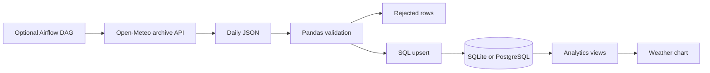

# Architecture

Separate HTTP extraction, Pandas validation, SQL upserts, and run metadata. Publish SQL views for daily trends, location summaries, and anomaly rates.

Natural-key upserts make reruns idempotent. A deterministic run ID identifies a location/date interval; its metadata describes the latest attempt. SQLite supports quick local tests, while Compose uses PostgreSQL. Anomaly flags use the current validated batch's mean and standard deviation.

## Execution boundaries

The local evidence uses SQLite. Open-Meteo data is reanalysis, not a station measurement guarantee. Run metadata is overwritten on rerun rather than retained as an attempt history. Anomaly flags depend on batch boundaries. The CLI does not archive raw data automatically; the demo does. Airflow is optional and its standalone UI is a development setup.

Tests use disposable SQLite stores. Live demos use public or fictional input. Container checks use a separate PostgreSQL service. See [execution evidence](results/demo.json) and [verification status](results/verification.md).
