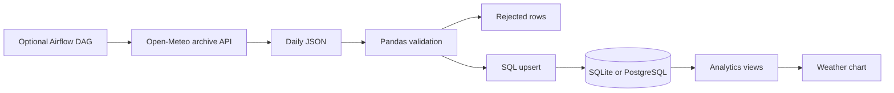

# Architecture

Raw input is JSON, staging is an in-memory Pandas frame, and durable storage consists of SQL tables and views. Airflow is an optional caller of the same pipeline.

See [design decisions](decisions.md) for tradeoffs.
